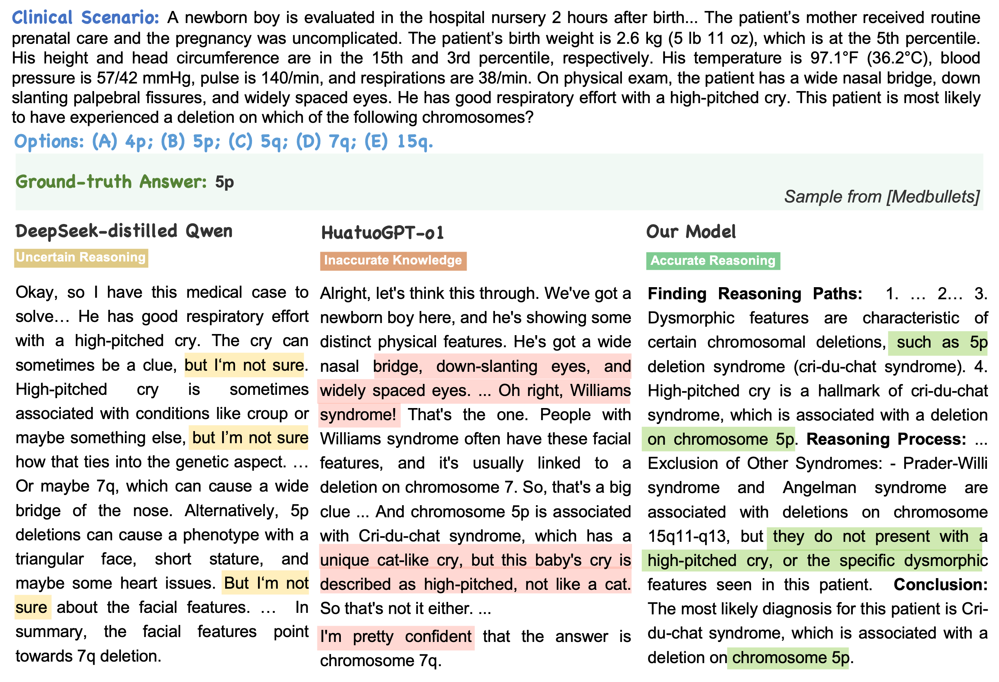
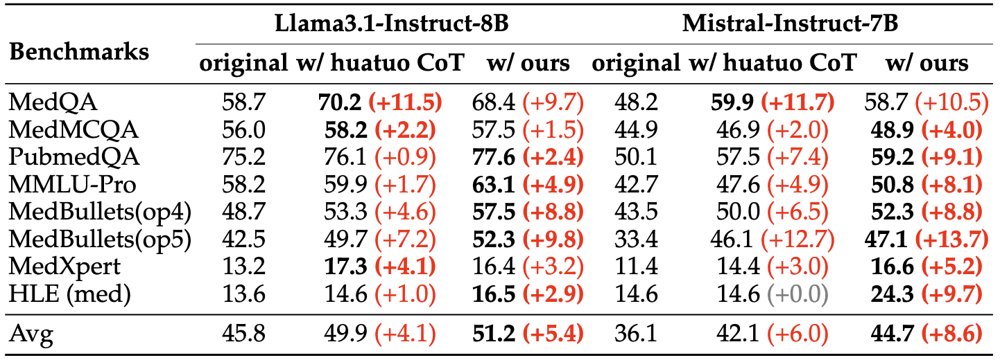
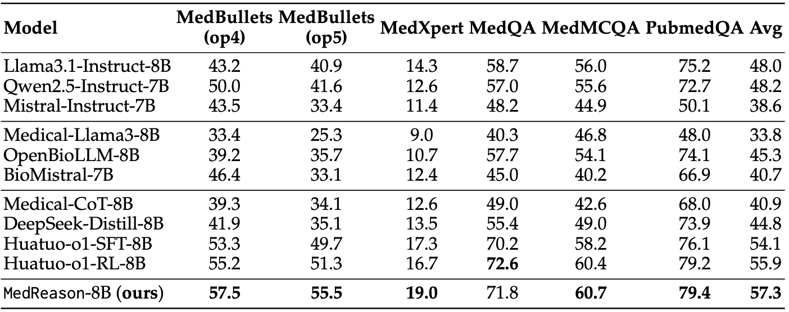

# MedReason: Eliciting Factual Medical Reasoning Steps in LLMs via Knowledge Graphs
<p align="center">
📃 <a href="https://arxiv.org/abs/2504.00993" target="_blank">Paper</a> ｜🤗 <a href="https://huggingface.co/UCSC-VLAA/MedReason-8B" target="_blank">MedReason-8B</a> | 📚 <a href="https://huggingface.co/datasets/UCSC-VLAA/MedReason" target="_blank">MedReason Data</a>
</p>

## 📢 News
- [🏆 May 26, 2025]Our dataset wins 3rd prize on [Huggingface Reasoning Datasets Competition](https://huggingface.co/blog/bespokelabs/reasoning-datasets-competition)!
- [📄💥 Apr 1, 2025] Our [arXiv paper](https://arxiv.org/abs/2504.00993) is released.

Star 🌟 us if you think it is helpful!!

## ⚡Introduction


**MedReason** is a large-scale high-quality medical reasoning dataset designed to enable faithful and explainable medical problem-solving in large language models (LLMs).

- We utilize a structured medical knowledge graph (KG) to convert clinical QA pairs into logical chains of reasoning, or “thinking paths”.
- Our pipeline generates detailed reasoning for various medical questions from 7 medical datasets, resulting in a dataset of **32,682** question-answer pairs, each with detailed, step-by-step explanations. 
- By finetuning with proposed [MedReason dataset](https://huggingface.co/datasets/UCSC-VLAA/MedReason), our best model [MedReason-8B](https://huggingface.co/UCSC-VLAA/MedReason-8B), achieves *state-of-the-art* performance.

We open-sourced our models, data, and code here.

## 📚 Data

- **Data Access**

| Data      | Description                       | Link                                                        |
| --------- | --------------------------------- | ----------------------------------------------------------- |
| MedReason | Our quality filtered data for SFT | [Link](https://huggingface.co/datasets/UCSC-VLAA/MedReason) |

- **Data Generation**

We provide the code for generating Chain-of-Thought reasoning based on medical QA pairs and knowledge-graph (KG) in `./src/data_generation`

1. Set the file path of each datasets in `./configs/dataset_configs.yml`
2. Fill your Azure endpoint and API key in `./src/data_generation/utils.py`
3. Run the following script

```bash
python ./src/data_generation/Generate_Reasoning.py --dataset medqa --sample <number_of_samples> --start_idx 0 --batch_size 1&
```

## 👨‍⚕️ Model

- **Model Access**

| Model             | Base Model                                                   | Link                                                       |
| ----------------- | ------------------------------------------------------------ | ---------------------------------------------------------- |
| MedReason-8B      | [HuatuoGPT-o1-8B](https://huggingface.co/FreedomIntelligence/HuatuoGPT-o1-8B) | [Link](https://huggingface.co/UCSC-VLAA/MedReason-8B)      |
| MedReason-Llama   | [Llama-3.1-8B-Instruct](https://huggingface.co/meta-llama/Llama-3.1-8B-Instruct) | [Link](https://huggingface.co/UCSC-VLAA/MedReason-Llama)   |
| MedReason-Mistral | [Mistral-7B-Instruct-v0.2](https://huggingface.co/mistralai/Mistral-7B-Instruct-v0.2) | [Link](https://huggingface.co/UCSC-VLAA/MedReason-Mistral) |

- **Deploy**: we provide a example code for direct inference with MedReason-8B. 

  Also, MedReason-8B can be deployed with tools like [vllm](https://github.com/vllm-project/vllm) or [Sglang](https://github.com/sgl-project/sglang), we provide code for model deployment using Sglang in `./src/evaluation/eval.py`

```python
from transformers import AutoModelForCausalLM, AutoTokenizer

model = AutoModelForCausalLM.from_pretrained('UCSC-VLAA/MedReason-8B',torch_dtype="auto",device_map="auto", use_safetensors= True)
model.eval()

tokenizer = AutoTokenizer.from_pretrained('UCSC-VLAA/MedReason-8B', trust_remote_code=True, padding_side='left')

input_text = "How to stop a cough?"
messages = [{"role": "user", "content": input_text}]

inputs = tokenizer(tokenizer.apply_chat_template(messages, tokenize=False,add_generation_prompt=True), return_tensors="pt").to(model.device)
outputs = model.generate(**inputs, max_new_tokens=2048)
print(tokenizer.decode(outputs[0], skip_special_tokens=True))
```

## 🚀 Training Piepline

Simply Supervised-Finetuning (SFT) using MedReason data improves the LLM’s medical reasoning capability.

Fine-tune the model on 8-GPU:

```bash
# based on Huatuo-o1-8B
accelerate launch --config_file ./configs/deepspeed_zero3.yaml \
    --num_processes 8  \
    --num_machines 1 \
    --machine_rank 0 \
    --deepspeed_multinode_launcher standard ./src/model_training/SFT.py \
    --model_path FreedomIntelligence/HuatuoGPT-o1-8B \
    --data_path /path/to/your/data \
    --n_epochs 3 \
    --experiment_name huatuo_o1_medreason_8B \
    --base_model Llama

# based on DeepSeek-distilled-Llama-8B
accelerate launch --config_file ./configs/deepspeed_zero3.yaml \
    --num_processes 8  \
    --num_machines 1 \
    --machine_rank 0 \
    --deepspeed_multinode_launcher standard ./src/model_training/SFT.py \
    --model_path deepseek-ai/DeepSeek-R1-Distill-Llama-8B \
    --data_path /path/to/your/data\
    --n_epochs 3 \
    --experiment_name distilled_llama_medreason_8B \
    --base_model Llama
```

## 🧐 Evaluation

- **Qualitative Results:**

  Case Study on Medbullets Benchmark. **MedReason-8B** generates accurate reasoning with reliable knowledge.



- **Performance on medical benchmarks**:

  Results of instruction-tuned LLMs fine-tuned with MedReason data:

  

  Performance of MedReason-8B on challenging and common medical QA benchmarks:

  

- **Run evaluation**:

1. You first need to install [Sglang](https://github.com/sgl-project/sglang). After installation, deploy the model you want to test using Sglang with the following command:

```bash
# deploy on 8 GPUs
log_num=0
model_name=UCSC-VLAA/MedReason-8B
port=28${log_num}35
CUDA_VISIBLE_DEVICES=0,1,2,3,4,5,6,7 python -m sglang.launch_server --model-path $model_name --port $port --mem-fraction-static 0.8 --dp 8 --tp 1  > sglang${log_num}.log 2>&1 &
```

2. Wait for the model to be deployed. After deployment, you can run the following code for evaluation. We use prompts that allow the model to respond freely. We find that the extracted results are consistently reliable and broadly cover the intended scope. You can also set the `--strict_prompt` option to use stricter prompts for more precise answer extraction.

```bash
log_num=0
task_floder=MedReason-8B-results
model_name=UCSC-VLAA/MedReason-8B
port=28${log_num}35

eval_file=./eval_data/medbullets_op4.jsonl
python ./src/evaluation/eval.py --model_name $model_name  --eval_file $eval_file --port $port --strict_prompt --batch_size 1000 --max_new_tokens 2000 --task_floder $task_floder
```

3. After completing the evaluation, run the following code to stop the Sglang service and release GPU memory.

```bash
pkill -f sglang
pkill -f multiprocessing.spawn
```

## 🙏🏼 Acknowledgement

We gratefully acknowledge the inspiring work of [HuatuoGPT-o1](https://github.com/FreedomIntelligence/HuatuoGPT-o1), which laid important groundwork for this research. We also thank the developers of the excellent tools [curator](https://github.com/bespokelabsai/curator/), [trl](https://github.com/huggingface/trl), and [sglang](https://github.com/sgl-project/sglang) for making this work possible.

## 📖 Citation

```
@misc{wu2025medreasonelicitingfactualmedical,
      title={MedReason: Eliciting Factual Medical Reasoning Steps in LLMs via Knowledge Graphs}, 
      author={Juncheng Wu and Wenlong Deng and Xingxuan Li and Sheng Liu and Taomian Mi and Yifan Peng and Ziyang Xu and Yi Liu and Hyunjin Cho and Chang-In Choi and Yihan Cao and Hui Ren and Xiang Li and Xiaoxiao Li and Yuyin Zhou},
      year={2025},
      eprint={2504.00993},
      archivePrefix={arXiv},
      primaryClass={cs.CL},
      url={https://arxiv.org/abs/2504.00993}, 
}
```

